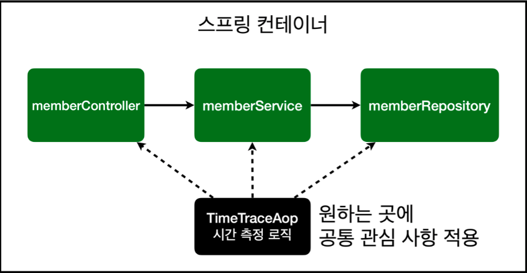

# 스프링 입문 - 코드로 배우는 스프링 부트, 웹 MVC, DB 접근 기술

[해당 강의 바로가기](https://www.inflearn.com/course/%EC%8A%A4%ED%94%84%EB%A7%81-%EC%9E%85%EB%AC%B8-%EC%8A%A4%ED%94%84%EB%A7%81%EB%B6%80%ED%8A%B8)

해당 강의는 예제를 만들어가면서 스프링 웹 애플리케이션 개발 전반을 빠르게 학습할 수 있는 강의로 스프링 입문자에게 적합한 수준의 강의입니다. **입문 강의인 만큼 강의자료를 토대로 프로젝트 환경설정부터 강의의 모든 내용을 기록합니다. 스프링 기본강의부터는 학습한 내용을 요약하여 정리 후 회고와 함께 업로드할 예정입니다.**

모든 코드는 저의 [Github 저장소](https://github.com/conagreen/study-spring/tree/main/hello-spring)에서 확인하실 수 있습니다.

## **[ 목차 ]**

- [스프링 입문 - 코드로 배우는 스프링 부트, 웹 MVC, DB 접근 기술](#스프링-입문---코드로-배우는-스프링-부트-웹-mvc-db-접근-기술)
  - [1. 프로젝트 환경설정](#1-프로젝트-환경설정)
    - [1-1. 프로젝트 생성](#1-1-프로젝트-생성)
    - [1-2. 라이브러리 살펴보기](#1-2-라이브러리-살펴보기)
    - [1-3. View 환경설정](#1-3-view-환경설정)
    - [1-4. 빌드하고 실행하기](#1-4-빌드하고-실행하기)
  - [2. 스프링 웹 개발 기초](#2-스프링-웹-개발-기초)
    - [2-1. 정적 컨텐츠](#2-1-정적-컨텐츠)
    - [2-2. MVC와 템플릿 엔진](#2-2-mvc와-템플릿-엔진)
    - [2-3. API](#2-3-api)
  - [3. 회원 관리 예제 - 백엔드 개발](#3-회원-관리-예제---백엔드-개발)
    - [3-1. 비즈니스 요구사항 정리](#3-1-비즈니스-요구사항-정리)
    - [3-2. 회원 도메인과 리포지토리 만들기](#3-2-회원-도메인과-리포지토리-만들기)
    - [3-3. 회원 리포지토리 테스트 케이스 작성](#3-3-회원-리포지토리-테스트-케이스-작성)
    - [3-4. 회원 서비스 개발](#3-4-회원-서비스-개발)
    - [3-5. 회원 서비스 테스트](#3-5-회원-서비스-테스트)
  - [4. 스프링 빈과 의존관계](#4-스프링-빈과-의존관계)
    - [4-1. 컴포넌트 스캔과 자동 의존관계 설정](#4-1-컴포넌트-스캔과-자동-의존관계-설정)
    - [4-2. 자바 코드로 직접 스프링 빈 등록하기](#4-2-자바-코드로-직접-스프링-빈-등록하기)
  - [5. 회원 관리 예제 - 웹 MVC 개발](#5-회원-관리-예제---웹-mvc-개발)
    - [5-1. 회원 웹 기능 - 홈 화면 추가](#5-1-회원-웹-기능---홈-화면-추가)
    - [5-2. 회원 웹 기능 - 등록](#5-2-회원-웹-기능---등록)
    - [5-3. 회원 웹 기능 - 조회](#5-3-회원-웹-기능---조회)
  - [6. 스프링 DB 접근 기술](#6-스프링-db-접근-기술)
    - [6-1. H2 데이터베이스 설치](#6-1-h2-데이터베이스-설치)
    - [6-2. 순수 JDBC](#6-2-순수-jdbc)
    - [6-3. 스프링 통합 테스트](#6-3-스프링-통합-테스트)
    - [6-4. 스프링 JdbcTemplate](#6-4-스프링-jdbctemplate)
    - [6-5. JPA](#6-5-jpa)
    - [6-6. 스프링 데이터 JPA](#6-6-스프링-데이터-jpa)
  - [7. AOP](#7-aop)
    - [7-1. AOP가 필요한 상황](#7-1-aop가-필요한-상황)
    - [7-2. AOP 적용](#7-2-aop-적용)

<br>

## 1. 프로젝트 환경설정

### 1-1. 프로젝트 생성
**사전 준비물**
>- Java 11 설치
>- IDE: IntelliJ 또는 Eclipse 설치 (저는 IntelliJ IDEA Ultimate 버전으로 진행하였습니다.)

**주의!** 가급적 JDK 11버전을 설치를 권장한다. 다른 버전을 설치하면 정상 작동하지 않을 가능성이 높음. 

- 프로젝트 선택
>- Project: Gradle Project
>- Spring Boot: 2.3.x
>- Language: Java
>- Packaging: Jar
>- Java: 11

- Project Metadata
>- groupId: hello
>- artifactId: hello-spring

- Dependencies: Spring Web, Thymeleaf

**Gradle 전체 설정**

`build.gradle`
```
plugins {
    id 'org.springframework.boot' version '2.3.1.RELEASE'
    id 'io.spring.dependency-management' version '1.0.9.RELEASE'
    id 'java'
}
  group = 'hello'
  version = '0.0.1-SNAPSHOT'
  sourceCompatibility = '11'
  
  repositories {
    mavenCentral()
}

dependencies {
    implementation 'org.springframework.boot:spring-boot-starter-thymeleaf'
    implementation 'org.springframework.boot:spring-boot-starter-web'
    testImplementation('org.springframework.boot:spring-boot-starter-test') {
        exclude group: 'org.junit.vintage', module: 'junit-vintage-engine'
    }
}
  test {
    useJUnitPlatform()
}
```
- 동작 확인
>- 기본 메인 클래스 실행
>- 스프링 부트 메인 실행 후 에러페이지로 간단하게 동작 확인 (http://localhost:8080)

**IntelliJ Gradle 대신 자바 직접 실행**

최근 IntelltJ 버전은 Gradle을 통해서 실행 하는 것이 기본 설정이다. 이렇게 하면 실행속도가 느리다. 다음과 같이 변경하면 자바로 바로 실행해서 실행속도가 더 빠르다.

- Preferences -> Build, Execution, Deployment -> Build Tools -> Gradle
>- Build and run using: Gradle -> IntelliJIDEA
>- Run tests using: Gradle -> IntelliJ IDEA

**IntelliJ JDK 설치 확인**

IntelliJ에서 자바 실행이 잘 안되면 다음 부분을 확인하자.(일반적으로 자동으로 설정이 되어 있지만, 가끔 문제가 되는 경우에 참고)

- 프로젝트 JDK 설정 -> 11로 지정
- Gradle JDK 설정 -> 11로 지정

### 1-2. 라이브러리 살펴보기
`Gradle은 의존관계가 있는 라이브러리를 함께 다운로드 한다.`

**스프링 부트 라이브러리**
- spring-boot-starter-web
  - spring-boot-starter-tomcat: 톰캣 (웹서버)
  - spring-webmvc: 스프링 웹 MVC
- spring-boot-starter-thymeleaf: 타임리프 템플릿 엔진(View)
- spring-boot-starter(공통): 스프링 부트 + 스프링 코어 + 로깅
  - spring-boot
    - spring-core
  - spring-boot-starter-logging
    - logback, slf4j

**테스트 라이브러리**
- spring-boot-starter-test
  - junit: 테스트 프레임워크
  - mockito: 목 라이브러리
  - assertj: 테스트 코드를 좀 더 편하게 작성하게 도와주는 라이브러리
  - spring-test: 스프링 통합 테스트 지원

### 1-3. View 환경설정
**Welcome Page 만들기**

`resources/static/index.html`
```Html
<!DOCTYPE HTML>
<html>
   <head>
      <title>Hello</title>
      <meta http-equiv="Content-Type" content="text/html; charset=UTF-8" />
  </head>
  <body>
  Hello
  <a href="/hello">hello</a>
  </body>
</html>
```

- 스프링 부트가 제공하는 Welcome Page 기능
>- `static/index.html`을 올려두면 Welcome page 기능을 제공한다.
>- 참고: https://docs.spring.io/spring-boot/docs/2.3.1.RELEASE/reference/html/spring-boot-features.html#boot-features-spring-mvc-welcome-page

**thymeleaf 템플릿 엔진**
- thymeleaf 공식 사이트: https://www.thymeleaf.org/
- 스프링 공식 튜토리얼: https://spring.io/guides/gs/serving-web-content/
- 스프링부트 메뉴얼: https://docs.spring.io/spring-boot/docs/2.3.1.RELEASE/reference/html/spring-boot-features.html#boot-features-spring-mvc-template-engines

```Java
@Controller
  public class HelloController {
      @GetMapping("hello")
      public String hello(Model model) {
          model.addAttribute("data", "hello!!");
          return "hello";
      }
}
```

`resources/templates/hello.html`
```Html
<!DOCTYPE HTML>
<html xmlns:th="http://www.thymeleaf.org">
  <head>
      <title>Hello</title>
      <meta http-equiv="Content-Type" content="text/html; charset=UTF-8" />
  </head>
<body>
<p th:text="'안녕하세요. ' + ${data}" >안녕하세요. 손님</p>
</body>
</html>
```

**thymeleaf 템플릿엔진 동작 확인**
- 실행: http://localhost:8080/hello

**동작 환경 그림**


- 컨트롤러에서 리턴 값으로 문자를 반환하면 뷰 리졸버(`viewResolver`)가 화면을 찾아서 처리한다.
  - 스프링 부트 템플릿엔진 기본 viewName 매핑
  - `resources: templates/` + {ViewName} + `.html`

### 1-4. 빌드하고 실행하기
**콘솔로 이동**
1. `./gradlew build`
2. `cd build/libs`
3. `java -jar hello-spring-0.0.1-SNAPSHOT.jar`
4. 실행 확인

**윈도우 사용자를 위한 팁**
1. 콘솔로 이동 -> 명령 프롬프트(cmd)로 이동
2. `./gradlew` -> `gradlew.bat`를 실행하면 된다.
3. 명령 프롬프트에서 `gradlew.bat`를 실행하려면 `gradlew`하고 엔터를 치면 된다.
4. `gradlew build`
5. 폴더 목록 확인 `ls` -> `dir`
- 윈도우에서 Git bash 터미널 사용하기
   - 링크: https://www.inflearn.com/questions/53961

<br>

## 2. 스프링 웹 개발 기초
### 2-1. 정적 컨텐츠
- 스프링 부트 정적 컨텐츠 기능
- https://docs.spring.io/spring-boot/docs/2.3.1.RELEASE/reference/html/spring-boot-features.html#boot-features-spring-mvc-static-content

`resources/static/hello-static.html`
```Html
<!DOCTYPE HTML>
<html>
<head>
  <title>static content</title>
  <meta http-equiv="Content-Type" content="text/html; charset=UTF-8" />
<body>
  정적 컨텐츠 입니다.
</body>
</html>
```
**실행**
- http://localhost:8080/hello-static.html

### 2-2. MVC와 템플릿 엔진
- MVC: Model, View, Controller

**Controller**
```Java
@Controller
public class HelloController {
  
  @GetMapping("hello-mvc")
  public String helloMvc(@RequestParam("name") String name, Model model) {
    model.addAttribute("name", name);
    return "hello-template";
  }
}
```
**View**

`resources/template/hello-template.html`
```Html
<html xmlns:th="http://www.thymeleaf.org">
<body>
<p th:text="'hello ' + ${name}">hello! empty</p>
</body>
</html>
```
**실행**
- http://localhost:8080/hello-mvc?name=spring

**MVC, 템플릿 엔진 이미지**


### 2-3. API
**@ResponseBody 문자 반환**
```Java
@Controller
public class HelloController {
  @GetMapping("hello-string")
  @ResponseBody
  public String helloString(@RequestParam("name") String name) {
      return "hello " + name;
  }
}
```
- `@ResponseBody`를 사용하면 뷰 리졸버(`viewResolver`)를 사용하지 않음
- 대신에 HTTP의 BODY에 문자 내용을 직접 반환(HTML BODY TAG를 말하는 것이 아님)

**실행**
- http://localhost:8080/hello-string?name=spring

**ResponseBody 객체 반환**
```Java
@Controller
public class HelloController {

  @GetMapping("hello-api")
  @ResponseBody
  public Hello helloApi(@RequestParam("name") String name) {
      Hello hello = new Hello();
      hello.setName(name);
      return hello;
  }

  static class Hello {
      private String name;

      public String getName() {
          return name;
      }

      public void setName(String name) {
          this.name = name;
      } 
  }
}
```
**실행**
- http://localhost:8080/hello-api?name=spring

**@ResponseBody 사용 원리**


- `@ResponseBody`를 사용
  - HTTP의 BODY에 문자 내용을 직접 반환
  - `viewResolver` 대신에 `HttpMessageConverter`가 동작
  - 기본 문자처리: `StringHttpMessageConverter`
  - 기본 객체처리: `MappingJackson2HttpMessageConverter`
  - byte 처리 등등 기타 여러 HttpMessageConverter가 기본으로 등록되어 있음

**참고: 클라이언트 HTTP Accept 헤더와 서버의 컨트롤러 반환 타입 정보 둘을 조합해서 `HttpMessageConverter`가 선택된다.**

<br>

## 3. 회원 관리 예제 - 백엔드 개발
### 3-1. 비즈니스 요구사항 정리
- 데이터: 회원ID, 이름
- 기능: 회원 등록, 조회
- 아직 데이터 저장소가 선정되지 않음(가상의 시나리오)

**일반적인 웹 애플리케이션 계층 구조**


- 컨트롤러: 웹 MVC의 컨트롤러 역할
- 서비스: 핵심 비즈니스 로직 구현
- 리포지토리: 데이터베이스에 접근, 도메인 객체를 DB에 저장하고 관리
- 도메인: 비즈니스 도메인 객체, 예) 회원 주문, 쿠폰 등등 주로 데이터베이스에 저장하고 관리됨

**클래스 의존관계**


- 아직 데이터 저장소가 선정되지 않아서, 우선 인터페이스로 구현 클래스를 변경할 수 있도록 설계
- 데이터 저장소는 RDB, NoSQL 등등 다양한 저장소를 고민중인 상황으로 가정
- 개발을 진행하기 위해서 초기 개발 단계에서는 구현체로 가벼운 메모리 기반의 데이터 저장소 사용

### 3-2. 회원 도메인과 리포지토리 만들기
**회원 객체**
```Java
package hello.hellospring.domain;

public class Member {
  
  private Long id;
  private String name;
      
  public Long getId() {
    return id;
  }

  public void setId(Long id) {
    this.id = id;
  }

  public String getName() {
    return name;
  }

  public void setName(String name) {
      this.name = name;
  } 
}
```

**회원 리포지토리 인터페이스**
```Java
package hello.hellospring.repository;

import hello.hellospring.domain.Member;

import java.util.List;
import java.util.Optional;

public interface MemberRepository {

  Member save(Member member);
  Optional<Member> findById(Long id);
  Optional<Member> findByName(String name);
  List<Member> findAll();

}
```

**회원 리포지토리 메모리 구현체**
```Java
package hello.hellospring.repository;

import hello.hellospring.domain.Member;

import java.util.*;

 /**
* 동시성 문제가 고려되어 있지 않음, 실무에서는 ConcurrentHashMap, AtomicLong 사용 고려
*/
public class MemoryMemberRepository implements MemberRepository {

    private static Map<Long, Member> store = new HashMap<>();
    private static long sequence = 0L;

    @Override
    public Member save(Member member) {
        member.setId(++sequence);
        store.put(member.getId(), member);
        return member;
    }

    @Override
    public Optional<Member> findById(Long id) {
        return Optional.ofNullable(store.get(id));
    }

    @Override
    public List<Member> findAll() {
        return new ArrayList<>(store.values());
    }

    @Override
    public Optional<Member> findByName(String name) {
        return store.values().stream()
                .filter(member -> member.getName().equals(name))
                .findAny();
    }

    public void clearStore() {
        store.clear();
    } 
}
```

### 3-3. 회원 리포지토리 테스트 케이스 작성
개발한 기능을 실행해서 테스트 할 때 자바의 main 메서드를 통해서 실행하거나, 웹 애플리케이션의 컨트롤러를 통해서 해당 기능을 실행한다. 이러한 방법은 준비하고 실행하는데 오래 걸리고, 반복 실행하기 어렵고 여러 테스트를 한번에 실행하기 어렵다는 단점이 있다. 자바는 JUnit이라는 프레임워크로 테스트를 실행해서 이러한 문제를 해결한다.

**회원 리포지토리 메모리 구현체 테스트**

`src/test/java`하위 폴더에 생성한다.
```Java
package hello.hellospring.repository;

import hello.hellospring.domain.Member;
import org.junit.jupiter.api.AfterEach;
import org.junit.jupiter.api.Test;

import java.util.List;
import java.util.Optional;

import static org.assertj.core.api.Assertions.*;

class MemoryMemberRepositoryTest {
  
  MemoryMemberRepository repository = new MemoryMemberRepository();

  @AfterEach
  public void afterEach() {
      repository.clearStore();
  }

  @Test
  public void save() {
      //given
      Member member = new Member();
      member.setName("spring");
      
      //when
      repository.save(member);

      //then
      Member result = repository.findById(member.getId()).get();
      assertThat(result).isEqualTo(member);
  }

  @Test
  public void findByName() {
      //given
      Member member1 = new Member();
      member1.setName("spring1");
      repository.save(member1);

      Member member2 = new Member();
      member2.setName("spring2");
      repository.save(member2);

      //when
      Member result = repository.findByName("spring1").get();

      //then
      assertThat(result).isEqualTo(member1);
  }

  @Test
  public void findAll() {
      //given
      Member member1 = new Member();
      member1.setName("spring1");
      repository.save(member1);

      Member member2 = new Member();
      member2.setName("spring2");
      repository.save(member2);

      //when
      List<Member> result = repository.findAll();
     
     //then
      assertThat(result.size()).isEqualTo(2);    
  }
}
```
- `@AfterEach`: 한번에 여러 테스트를 실행하면 메모리 DB에 직전 테스트의 결과가 남을 수 있다. 이렇게 되면 이전 테스트 때문에 다음 테스트가 실패할 가능성이 있다. `@AfterEach`를 사용하면 각 테스트가 종료될 때 마다 이 기능을 실행한다. 여기서는 메모리 DB에 저장된 데이터를 삭제한다.
- 테스틑 각각 독립적으로 실행되어야 한다. 테스트 순서에 의존관계가 있는 것은 좋은 테스트가 아니다.

### 3-4. 회원 서비스 개발
```Java
package hello.hellospring.service;
  
import hello.hellospring.domain.Member;
import hello.hellospring.repository.MemberRepository;
  
import java.util.List;
import java.util.Optional;

public class MemberService {

    private final MemberRepository memberRepository = new MemoryMemberRepository();

    /**
    * 회원가입
    */
    public Long join(Member member) {
      
      validateDuplicateMember(member); //중복 회원 검증 
      memberRepository.save(member);
      return member.getId();
    }

    private void validateDuplicateMember(Member member) {
        memberRepository.findByName(member.getName())
                .ifPresent(m -> {
                    throw new IllegalStateException("이미 존재하는 회원입니다.");
                });
    }

    /**
    *전체 회원 조회
    */
    public List<Member> findMembers() {
        return memberRepository.findAll();
    }

    /**
    회원 조회
    */
    public Optional<Member> findOne(Long memberId) {
        return memberRepository.findById(memberId);
    } 
}
```

### 3-5. 회원 서비스 테스트

**기존에는 회원 서비스가 메모리 회원 리포지토리를 직접 생성하게 했다.**
```Java
public class MemberService {

    private final MemberRepository memberRepository = new MemoryMemberRepository();

}
```
**회원 리포지토리의 코드가 회원 서비스 코드를 DI 가능하게 변경한다.**
```Java
public class MemberService {

    private final MemberRepository memberRepository;

        public MemberService(MemberRepository memberRepository) {
            this.memberRepository = memberRepository;
        }
        ... 
}
```

**회원 서비스 테스트**
```Java
package hello.hellospring.service;

import hello.hellospring.domain.Member;
import hello.hellospring.repository.MemoryMemberRepository;
import org.junit.jupiter.api.BeforeEach;
import org.junit.jupiter.api.Test;

import static org.assertj.core.api.Assertions.*;
import static org.junit.jupiter.api.Assertions.*;

class MemberServiceTest {
  
  MemberService memberService;
  MemoryMemberRepository memberRepository;
      
  @BeforeEach
  public void beforeEach() {
      memberRepository = new MemoryMemberRepository();
      memberService = new MemberService(memberRepository);
  }

  @AfterEach
  public void afterEach() {
      memberRepository.clearStore();
  }

  @Test
  public void 회원가입() throws Exception {
      //Given
      Member member = new Member();
      member.setName("hello");

      //When
      Long saveId = memberService.join(member);

      //Then
      Member findMember = memberRepository.findById(saveId).get();
      assertEquals(member.getName(), findMember.getName());
  }

  @Test
  public void 중복_회원_예외() throws Exception {
      //Given
      Member member1 = new Member();
      member1.setName("spring");
          
      Member member2 = new Member();
      member2.setName("spring");

      //When
      memberService.join(member1);
      IllegalStateException e = assertThrows(IllegalStateException.class,
              () -> memberService.join(member2)); // 예외가 발생해야 한다. 
              
      assertThat(e.getMessage()).isEqualTo("이미 존재하는 회원입니다.");
  } 
}
```

<br>

## 4. 스프링 빈과 의존관계
### 4-1. 컴포넌트 스캔과 자동 의존관계 설정 
회원 컨트롤러가 회원서비스와 회원 리포지토리를 사용할 수 있게 의존관계를 준비하자.

**회원 컨트롤러에 의존관계 추가**

```Java
package hello.hellospring.controller;

import hello.hellospring.service.MemberService;
import org.springframework.beans.factory.annotation.Autowired;
import org.springframework.stereotype.Controller;

@Controller
public class MemberController {
    
    private final MemberService memberService;
      
    @Autowired
    public MemberController(MemberService memberService) {
        this.memberService = memberService;
    }
}
```
- 생성자에 `@Autowired`가 있으면 스프링이 연관된 객체를 스프링 컨테이너에서 찾아서 넣어준다. 이렇게 객체 의존관계를 외부에서 넣어주는 것을 DI(Dependency Injection), 의존성 주입이라 한다.
- 이전 테스트에서는 개발자가 직접 주입했고, 여기서는 @Autowired에 의해 스프링이 주입해준다.

**오류 발생**
```
Consider defining a bean of type 'hello.hellospring.service.MemberService' in your configuration.
```
**memberService가 스프링 빈으로 등록되어 있지 않다.**

> 참고: helloController는 스프링이 제공하는 컨트롤러여서 스프링 빈으로 자동 등록된다 ->
`@Controller`가 있으면 자동 등록!

**스프링 빈을 등록하는 2가지 방법**
- 컴포넌트 스캔과 자동 의존관계 설정
- 자바 코드로 직접 스프링 빈 동륵하기

**컴포넌트 스캔 원리**
- `@Component` 어노테이션이 있으면 스프링 빈으로 자동 등록된다.
- `@Controller` 컨트롤러가 스프링 빈으로 자동 등록된 이유도 컴포넌트 스캔 때문이다.

**`@Component`를 포함하는 다음 어노테이션도 스프링 빈으로 자동 등록된다.**
- `@Controller`
- `@Service`
- `@Repository`

**회원 서비스 스프링 빈 등록**

```Java
@Service
public class MemberService {

    private final MemberRepository memberRepository;

    @Autowired
    public MemberService(MemberRepository memberRepository) {
        this.memberRepository = memberRepository;
    }
}
```
> 참고: 생성자에 `@Autowired`를 사용하면 객체 생성 시점에 스프링 컨테이너에서 해당 스프링 빈을 찾아서 주입한다. (생성자가 1개일 경우 `@Autowired`는 생략 가능하다.)

**회원 리포지토리 스프링 빈 등록**

```Java
@Repository
public class MemoryMemberRepository implements MemberRepository {}
```
- `memberService`와 `memberRepository`가 스프링 컨테이너에 스프링 빈으로 등록되었다.

> 참고: 스프링은 스프링 컨테이너에 스프링 빈을 등록할 때, 기본으로 싱글톤으로 등록한다.(유일하기 하나만 등록해서 공유한다.) 따라서 같은 스프링 빈이면 모두 같은 인스턴스다. 설정으로 싱글톤이 아니게 설정할 수 있지만, 특별한 경우를 제외하면 대부분 싱글톤을 사용한다.

### 4-2. 자바 코드로 직접 스프링 빈 등록하기
- 회원 서비스와 회원 리포지토리의 @Service, @Repository, @Autowired 어노테이션을 제거하고 진행한다.

```java
package hello.hellospring;

import hello.hellospring.repository.MemberRepository;
import hello.hellospring.repository.MemoryMemberRepository;
import hello.hellospring.service.MemberService;
import org.springframework.context.annotation.Bean;
import org.springframework.context.annotation.Configuration;

@Configuration
public class SpringConfig {

    @Bean
    public MemberService memberService() {
        return new MemberService(memberRepository());
    }
      
    @Bean
    public MemberRepository memberRepository() {
      return new MemoryMemberRepository();
    }
}
```
**여기서는 향후 메모리 리포지토리를 다른 리포지토리로 변경할 예정이므로, 컴포넌트 스캔 방식 대신에 자바 코드로 스프링 빈을 설정하겠다.**

> 참고: XML로 설정하는 방식도 있지만 최근에는 잘 사용하지 않으므로 생략한다.

> 참고: DI에는 필드 주입, setter 주입, 생성자 주입 이렇게 3가지 방법이 있다. 의존관계가 실행중에 동적으로 변하는 경우는 거의 없으므로 생성자 주입을 권장한다.

> 참고: 실무에서는 주로 정형화된 컨트롤러, 서비스, 리포지토리 같은 코드는 컴포넌트 스캔을 사용한다. 그리고 정형화 되지 않거나, 상황에 따라 구현 클래스를 변경해야 하면 설정을 통해 스프링 빈으로 등록한다.

> 주의: `@Autowired`를 통한 DI는 `helloController`, `memberService` 등과 같이 스프링이 관리하는 객체에서만 동작한다. 스프링 빈으로 등록하지 않고 내가 직접 생성한 객체에서는 동작하지 않는다.

<br>

## 5. 회원 관리 예제 - 웹 MVC 개발

### 5-1. 회원 웹 기능 - 홈 화면 추가

**홈 컨트롤러 추가**
```Java
package hello.hellospring.controller;
    
import org.springframework.stereotype.Controller;
import org.springframework.web.bind.annotation.GetMapping;

@Controller
public class HomeController {

    @GetMapping("/")
    public String home() {     
          return "home";
    }
}
```

**회원 관리용 홈**
```Html
<!DOCTYPE HTML>
<html xmlns:th="http://www.thymeleaf.org">
<body>

<div class="container">
    <div>
        <h1>Hello Spring</h1>
        <p>회원 기능</p>
        <p>
            <a href="/members/new">회원 가입</a>
            <a href="/members">회원 목록</a>
        </p> 
    </div>
</div> <!-- /container -->

</body>
</html>
```
> 참고: 컨트롤러가 정적 파일보다 우선순위가 높다.
> 
### 5-2. 회원 웹 기능 - 등록

[회원 등록 폼 개발]

**회원 등록 폼 컨트롤러**
```Java
@Controller
public class MemberController {

    private final MemberService memberService;

    @Autowired
    public MemberController(MemberService memberService) {
        this.memberService = memberService;
    }

    @GetMapping(value = "/members/new")
    public String createForm() {
        return "members/createMemberForm";
    }

}
```

**회원 등록 폼 HTML**(`resources/templates/members/createMemberForm`)
```Html
<!DOCTYPE HTML>
<html xmlns:th="http://www.thymeleaf.org">
<body>
<div class="container">
    <form action="/members/new" method="post">
        <div class="form-group">
            <label for="name">이름</label>
            <input type="text" id="name" name="name" placeholder="이름을 입력하세요"> 
        </div>
        <button type="submit">등록</button> 
    </form>
</div> <!-- /container -->
</body>
</html>
```

[회원 등록 컨트롤러]

**웹 등록 화면에서 데이터를 전달 받을 폼 객체**
```Java
package hello.hellospring.controller;

public class MemberForm {
    private String name;

    public String getName() {
        return name;
    }

    public void setName(String name) {
        this.name = name;
    } 
}
```

**회원 컨트롤러에서 회원을 실제 등록하는 기능**
```Java
@PostMapping(value = "/members/new")
public String create(MemberForm form) {

    Member member = new Member();
    member.setName(form.getName());

    memberService.join(member);

    return "redirect:/";
}
```

### 5-3. 회원 웹 기능 - 조회
**회원 컨트롤러에서 조회 기능**
```Java
@GetMapping(value = "/members")
public String list(Model model) {
    List<Member> members = memberService.findMembers();
    model.addAttribute("members", members);
    return "members/memberList";
}
```

**회원 리스트 HTML**
```Html
<!DOCTYPE HTML>
<html xmlns:th="http://www.thymeleaf.org">
<body>

<div class="container">
    <div>
        <table>
            <thead>
            <tr>
                <th>#</th>
                <th>이름</th> 
            </tr>
            </thead>
            <tbody>
            <tr th:each="member : ${members}">
                <td th:text="${member.id}"></td>
                <td th:text="${member.name}"></td>
            </tr>
            </tbody>
        </table>
    </div>

</div> <!-- /container -->
</body>
</html>
```

<br>

## 6. 스프링 DB 접근 기술
### 6-1. H2 데이터베이스 설치
개발이나 테스트 용도로 가볍고 편리한 DB, 웹 화면 제공

- https://www.h2database.com
- 다운로드 및 설치
- h2 데이터베이스 버전은 스프링 부트 버전에 맞춘다.
- 권한 주기: `chmod 755 h2.sh` (윈도우 사용자는 x)
- 실행: `./h2.sh`(윈도우 사용자는 h2.bat)
- 데이터베이스 파일 생성 방법
  - `jdbc:h2:~/test`(최초 한번)
  - `~/test.mv.db`파일 생성 확인
  - 이후부터는 `jdbc:h2:tcp://localhost/~/test`

**테이블 생성하기**

테이블 관리를 위해 프로젝트 루트에 `sql/ddl.sql` 파일을 생성

```sql
drop table if exists member CASCADE;
create table member
(
    id   bigint generated by default as identity,
    name varchar(255),
    primary key (id)
);
```
H2 데이터베이스에 접근해서 `member` 테이블 생성

**H2 데이터베이스가 정상 생성되지 않을 때**

다음과 같은 오류 메시지가 나오며 H2 데이터베이스가 정상 생성되지 않는 경우가 있다.


**해결방안은 다음과 같다.**
1. H2 데이터베이스를 종료하고, 다시 시작한다.
2. 웹 브라우저가 자동 실행되면 주소창에 다음과 같이 되어있다.(100.1.2.3이 아니라 임의의 숫자가 나온다.)


3. 다음과 같이 앞 부분만 `100.1.2.3` -> `localhost`로 변경하고 Enter를 입력한다. 나머지 부분은 절대 변경하면 안된다. (특히 뒤에 세션 부분이 변경되면 안된다.)


4. 데이터베이스 파일을 생성하면(`jdbc:h2:~/test`), 데이터베이스가 정상 생성된다.

### 6-2. 순수 JDBC
[환경설정]

**build.gradle 파일에 jdbc, h2 데이터베이스 관련 라이브러리 추가**
```
implementation 'org.springframework.boot:spring-boot-starter-jdbc'
runtimeOnly 'com.h2database:h2'
```

**스프링 부트 데이터베이스 연결 설정 추가**

`resources/application.properties`
```
spring.datasource.url=jdbc:h2:tcp://localhost/~/test
spring.datasource.driver-class-name=org.h2.Driver
spring.datasource.username=sa
```
> **주의!**: 스프링부트2.4부터는 `spring.datasource.username=sa`를 꼭 추가해주어야 한다. 그렇지 않으면 `Wrong user name or password` 오류가 발생한다. 참고로 다음과 같이 마지막에 공백이 들어가면 같은 오류가 발생한다. `spring.datasource.username=sa `<- 공백 주의, 공백은 모두 제거해야 한다.

> 참고: 인텔리J 커뮤니티(무료) 버전의 경우 `application.properties` 파일 내 설정 코드가 회색으로 나온다. 엔터프라이즈(유료) 버전에서 제공하는 스프링의 소스 코드를 연결해주는 편의 기능이 빠진 것인데, 실제 동작하는데는 아무런 문제가 없다.

[Jdbc 리포지토리 구현]

주의! 이렇게 JDBC API로 직접 코딩하는 것은 20년 전 이야기이다. 따라서 고대 개발자들이 이렇게 고생하고 살았구나 생각하고, 정신건강을 위해 참고만 하고 넘어가자.

**Jdbc 회원 리포지토리**
```Java
package hello.hellospring.repository;

import hello.hellospring.domain.Member;
import org.springframework.jdbc.datasource.DataSourceUtils;

import javax.sql.DataSource;
import java.sql.*;
import java.util.ArrayList;
import java.util.List;
import java.util.Optional;

public class JdbcMemberRepository implements MemberRepository {

    private final DataSource dataSource;

    public JdbcMemberRepository(DataSource dataSource) {
        this.dataSource = dataSource;
    }

    @Override
    public Member save(Member member) {
        String sql = "insert into member(name) values(?)";

        Connection conn = null;
        PreparedStatement pstmt = null;
        ResultSet rs = null;

        try {
            conn = getConnection();
            pstmt = conn.prepareStatement(sql, Statement.RETURN_GENERATED_KEYS);
            
            pstmt.setString(1, member.getName());
            
            pstmt.executeUpdate();
            rs = pstmt.getGeneratedKeys();
            
            if (rs.next()) {
                member.setId(rs.getLong(1));
            } else {
                throw new SQLException("id 조회 실패");
            }
            return member;
        } catch (Exception e) {
            throw new IllegalStateException(e);
        } finally {
            close(conn, pstmt, rs);
        }
    }

    @Override
    public Optional<Member> findById(Long id) {
        String sql = "select * from member where id = ?";
      
        Connection conn = null;
        PreparedStatement pstmt = null;
        ResultSet rs = null;

        try {
            conn = getConnection();
            pstmt = conn.prepareStatement(sql);
            pstmt.setLong(1, id);

            rs = pstmt.executeQuery();
            
            if(rs.next()) {
                Member member = new Member();
                member.setId(rs.getLong("id"));
                member.setName(rs.getString("name"));
                return Optional.of(member);
            } else {
                return Optional.empty();
            }

        } catch (Exception e) {
            throw new IllegalStateException(e);
        } finally {
            close(conn, pstmt, rs);
        } 
    
    }


    @Override
    public List<Member> findAll() {
        String sql = "select * from member";
        Connection conn = null;
        PreparedStatement pstmt = null;
        ResultSet rs = null;

        try {
            conn = getConnection();
            pstmt = conn.prepareStatement(sql);

            rs = pstmt.executeQuery();

            List<Member> members = new ArrayList<>();
            while(rs.next()) {
                Member member = new Member();
                member.setId(rs.getLong("id"));
                member.setName(rs.getString("name"));
                members.add(member);
            }

            return members;
        } catch (Exception e) {
            throw new IllegalStateException(e);
        } finally {
            close(conn, pstmt, rs);
        }
    }

    @Override
    public Optional<Member> findByName(String name) {
        String sql = "select * from member where name = ?";

        Connection conn = null;
        PreparedStatement pstmt = null;
        ResultSet rs = null;

        try {
            conn = getConnection();
            pstmt = conn.prepareStatement(sql);
            pstmt.setString(1, name);
            rs = pstmt.executeQuery();

            if(rs.next()) {
                Member member = new Member();
                member.setId(rs.getLong("id"));
                member.setName(rs.getString("name"));
                return Optional.of(member);
            }

            return Optional.empty();
        } catch (Exception e) {
            throw new IllegalStateException(e);
        } finally {
            close(conn, pstmt, rs);
        }
    }

    private Connection getConnection() {
        return DataSourceUtils.getConnection(dataSource);
    }

    private void close(Connection conn, PreparedStatement pstmt, ResultSet rs) {
        try {
            if (rs != null) {
                rs.close();
            }
        } catch (SQLException e) {
            e.printStackTrace();
        } 
        try {
            if (pstmt != null) {
                pstmt.close();
            }
        } catch (SQLException e) {
            e.printStackTrace();
        }
        try {
            if (conn != null) {
                close(conn);
            }
        } catch (SQLException e) {
            e.printStackTrace();
        }
    }

    private void close(Connection conn) throws SQLException {
        DataSourceUtils.releaseConnection(conn, dataSource);
    } 
}

```

**스프링 설정 변경**
```Java
package hello.hellospring;

import hello.hellospring.repository.JdbcMemberRepository;
import hello.hellospring.repository.JdbcTemplateMemberRepository;
import hello.hellospring.repository.MemberRepository;
import hello.hellospring.repository.MemoryMemberRepository;
import hello.hellospring.service.MemberService;
import org.springframework.context.annotation.Bean;
import org.springframework.context.annotation.Configuration;

import javax.sql.DataSource;

@Configuration
public class SpringConfig {

    private final DataSource dataSource;

    public SpringConfig(DataSource dataSource) {
        this.dataSource = dataSource;
    } 
    
    @Bean
    public MemberService memberService() {
        return new MemberService(memberRepository());
    }

    @Bean
    public MemberRepository memberRepository() {
      // return new MemoryMemberRepository();
      return new JdbcMemberRepository(dataSource);
    }
}
```
- DataSource는 데이터베이스 커넥션을 획득할 때 사용하는 객체다. 스프링 부트는 데이터베이스 커넥션 정보를 바탕으로 DataSource를 생성하고 스프링 빈으로 만들어둔다. 그래서 DI를 받을 수 있다.

**구현 클래스 추가 이미지**


**스프링 설정 이미지**


- 개방-폐쇄 원칙(OCP, Open-Closed Principle)
  - 확장에는 열려있고, 수정 변경에는 닫혀있다.
- 스프링의 DI(Dependencies Injection)을 사용하면 **기존 코드를 전혀 손대지 않고, 설정만으로 구현 클래스를 변경**할 수 있다.
- 회원을 등록하고 DB에 결과가 잘 입력되는지 확인하자.
- 데이터를 DB에 저장하므로 스프링 서버를 다시 실행해도 데이터가 안전하게 저장된다.

### 6-3. 스프링 통합 테스트
스프링 컨테이너와 DB까지 연결한 통합 테스트를 진행해보자.

**회원 서비스 스프링 통합 테스트**

```Java
package hello.hellospring.service;

import hello.hellospring.domain.Member;
import hello.hellospring.repository.MemberRepository;
import org.junit.jupiter.api.Test;
import org.springframework.beans.factory.annotation.Autowired;
import org.springframework.boot.test.context.SpringBootTest;

import org.springframework.transaction.annotation.Transactional;

import static org.assertj.core.api.Assertions.assertThat;
import static org.junit.jupiter.api.Assertions.assertEquals;
import static org.junit.jupiter.api.Assertions.assertThrows;

@SpringBootTest
@Transactional
class MemberServiceIntegrationTest {

    @Autowired MemberService memberService;
    @Autowired MemberRepository memberRepository;
    
    @Test
    public void 회원가입() throws Exception {

      
        //Given
        Member member = new Member();
        member.setName("hello");

        //When
        Long saveId = memberService.join(member);

        //Then
        Member findMember = memberRepository.findById(saveId).get();
        assertEquals(member.getName(), findMember.getName());
    }

    @Test
    public void 중복_회원_예외() throws Exception {

        //Given
        Member member1 = new Member();
        member1.setName("spring");

        Member member2 = new Member();
        member2.setName("spring");

        //When
        memberService.join(member1);
        IllegalStateException e = assertThrows(IllegalStateException.class,
                () -> memberService.join(member2)); // 예외가 발생해야 한다.
        
        assertThat(e.getMessage()).isEqualTo("이미 존재하는 회원입니다.");     
    }
}
```

- `@SpringBootTest`: 스프링 컨테이너와 테스트를 함께 실행한다.
- `@Transactional`: 테스트 케이스에 이 어노테이션이 있으면, 테스트 시작 전에 트랜잭션을 시작하고, 테스트 완료 후에 항상 롤백한다. 이렇게 하면 DB에 데이터가 남지 않으므로 다음 테스트에 영향을 주지 않는다.

### 6-4. 스프링 JdbcTemplate
- 순수 Jdbc와 동일한 환경설정을 하면 된다.
- 스프링 JdbcTemplate과 MyBatis 같은 라이브러리는 JDBC API에서 본 반복 코드를 대부분 제거해준다. 하지만 SQL은 직접 작성해야 한다.

**스프링 JdbcTemplate**
```Java
package hello.hellospring.repository;

import hello.hellospring.domain.Member;
import org.springframework.jdbc.core.JdbcTemplate;
import org.springframework.jdbc.core.RowMapper;
import org.springframework.jdbc.core.namedparam.MapSqlParameterSource;
import org.springframework.jdbc.core.simple.SimpleJdbcInsert;

import javax.sql.DataSource;
import java.sql.ResultSet;
import java.sql.SQLException;
import java.util.HashMap;
import java.util.List;
import java.util.Map;
import java.util.Optional;

public class JdbcTemplateMemberRepository implements MemberRepository {

    private final JdbcTemplate jdbcTemplate;

    public JdbcTemplateMemberRepository(DataSource dataSource) {
        jdbcTemplate = new JdbcTemplate(dataSource);
    }

    @Override
    public Member save(Member member) {
        SimpleJdbcInsert jdbcInsert = new SimpleJdbcInsert(jdbcTemplate);
        jdbcInsert.withTableName("member").usingGeneratedKeyColumns("id");

        Map<String, Object> parameters = new HashMap<>();
        parameters.put("name", member.getName());

        Number key = jdbcInsert.executeAndReturnKey(new MapSqlParameterSource(parameters));
        member.setId(key.longValue());
        return member;
    }

    @Override
    public Optional<Member> findById(Long id) {
        List<Member> result = jdbcTemplate.query("select * from member where id = ?", memberRowMapper(), id);
        return result.stream().findAny();
    }

    @Override
    public List<Member> findAll() {
        return jdbcTemplate.query("select * from member", memberRowMapper());
    }

    @Override
    public Optional<Member> findByName(String name) {
        List<Member> result = jdbcTemplate.query("select * from member where name = ?", memberRowMapper(), name);
          return result.stream().findAny();
      }

    private RowMapper<Member> memberRowMapper() {
        return (rs, rowNum) -> {
            Member member = new Member();
            member.setId(rs.getLong("id"));
            member.setName(rs.getString("name"));
            return member;
        }; 
    }
}
```

**JdbcTemplate을 사용하도록 스프링 설정 변경**

```Java
package hello.hellospring;

import hello.hellospring.repository.JdbcMemberRepository;
import hello.hellospring.repository.JdbcTemplateMemberRepository;
import hello.hellospring.repository.MemberRepository;
import hello.hellospring.repository.MemoryMemberRepository;
import hello.hellospring.service.MemberService;
import org.springframework.context.annotation.Bean;
import org.springframework.context.annotation.Configuration;

import javax.sql.DataSource;
@Configuration
public class SpringConfig {

    private final DataSource dataSource;

    public SpringConfig(DataSource dataSource) {
        this.dataSource = dataSource;
    }

    @Bean
    public MemberService memberService() {
        return new MemberService(memberRepository());
    }

    @Bean
    public MemberRepository memberRepository() {
        // return new MemoryMemberRepository();
        // return new JdbcMemberRepository(dataSource);
        return new JdbcTemplateMemberRepository(dataSource);
    }
}
```

### 6-5. JPA

- JPA는 기존의 반복 코드는 물론이고, 기본적인 SQL도 JPA가 직접 만들어서 실행해준다.
- JPA를 사용하면, SQL과 데이터 중심의 설계에서 객체 중심의 설계로 패러다임을 전환할 수 있다.
- JPA를 사용하면 개발 생산성을 크게 높일 수 있다.

**build.gradle 파일에 JPA, h2 데이터베이스 관련 라이브러리 추가**

```Java
dependencies {
  implementation 'org.springframework.boot:spring-boot-starter-thymeleaf'
  implementation 'org.springframework.boot:spring-boot-starter-web'
//implementation 'org.springframework.boot:spring-boot-starter-jdbc' 
  implementation 'org.springframework.boot:spring-boot-starter-data-jpa'
  runtimeOnly 'com.h2database:h2' 
  testImplementation('org.springframework.boot:spring-boot-starter-test') {
      exclude group: 'org.junit.vintage', module: 'junit-vintage-engine'
  }
}
```

`spring-boot-starter-data-jpa`는 내부에 jdbc 관련 라이브러리를 포함한다. 따라서 jdbc는 제거해도 된다.

**스프링 부트에 JPA 설정 추가**

`resources/application.properties`
```Java
spring.datasource.url=jdbc:h2:tcp://localhost/~/test
spring.datasource.driver-class-name=org.h2.Driver
spring.datasource.username=sa

spring.jpa.show-sql=true
spring.jpa.hibernate.ddl-auto=none
```

- `show-sql`: JPA가 생성하는 SQL을 출력한다.
- `ddl-auto`: JPA는 테이블을 자동으로 생성하는 기능을 제공하는데 `none`를 사용하면 해당 기능을 끈다.
  - `create`를 사용하면 엔티티 정보를 바탕으로 테이블도 직접 생성해준다. -> 해보자.

**JPA 엔티티 매핑**
```Java
package hello.hellospring.domain;

import javax.persistence.Entity;
import javax.persistence.GeneratedValue;
import javax.persistence.GenerationType;
import javax.persistence.Id;

@Entity
public class Member {

    @Id @GeneratedValue(strategy = GenerationType.IDENTITY)
    private Long id;
    private String name;

    public Long getId() {
        return id;
    }

    public void setId(Long id) {
        this.id = id;
    }

    public String getName() {
        return name;
    }

    public void setName(String name) {
        this.name = name;
    }
}
```

**JPA 회원 리포지토리**

```Java
package hello.hellospring.repository;

import hello.hellospring.domain.Member;

import javax.persistence.EntityManager;
import java.util.List;
import java.util.Optional;

public class JpaMemberRepository implements MemberRepository {

    private final EntityManager em;

    public JpaMemberRepository(EntityManager em) {
        this.em = em;
    }

    public Member save(Member member) {
        em.persist(member);
        return member;
    }

    public Optional<Member> findById(Long id) {
        Member member = em.find(Member.class, id);
        return Optional.ofNullable(member);
    }

    public List<Member> findAll() {
        return em.createQuery("select m from Member m", Member.class)
                .getResultList();
    }

    public Optional<Member> findByName(String name) {
        List<Member> result = em.createQuery("select m from Member m where m.name = :name", Member.class)
                .setParameter("name", name)
                .getResultList();
        return result.stream().findAny();
    } 
}
```

**서비스 계층에 트랜잭션 추가**

```Java
import org.springframework.transaction.annotation.Transactional

@Transactional
public class MemberService {}
```
- `org.springframework.transaction.annotation.Transactional`를 사용하자.
- 스프링은 해당 클래스의 메서드를 싱핼할 때 트랜잭션을 시작하고, 메서드가 정상 종료되면 트랜잭션을 커밋한다. 만약 런타임 예외가 발생하면 롤백한다.
- **JPA를 통한 모든 데이터 변경은 트랜잭션 안에서 실행해야 한다.**

**JPA를 사용하도록 스프링 설정 변경**

```Java
package hello.hellospring;

import hello.hellospring.repository.*;
import hello.hellospring.service.MemberService;
import org.springframework.context.annotation.Bean;
import org.springframework.context.annotation.Configuration;

import javax.persistence.EntityManager;
import javax.sql.DataSource;

@Configuration
public class SpringConfig {

    private final DataSource dataSource;
    private final EntityManager em;

    public SpringConfig(DataSource dataSource, EntityManager em) {
        this.dataSource = dataSource;
        this.em = em;
    }

    @Bean
    public MemberService memberService() {
        return new MemberService(memberRepository());
    }
    
    @Bean
    public MemberRepository memberRepository() {
        // return new MemoryMemberRepository();
        // return new JdbcMemberRepository(dataSource);
        // return new JdbcTemplateMemberRepository(dataSource);
        return new JpaMemberRepository(em);
    }
}
```

### 6-6. 스프링 데이터 JPA
스프링 부트와 JPA만 사용해도 개발 생산성이 정말 많이 증가하고, 개발해야할 코드도 확연히 줄어든다. 여기에 스프링 데이터 JPA를 사용하면, 기존의 한계를 넘어 마치 마법처럼, 리포지토리에 구현 클래스 없이 인터페이스 만으로 개발을 완료할 수 있다. 그리고 반복 개발해온 기본 CRUD 기능도 스프링 데이터 JPA가 모두 제공한다. 스프링 부트와 JPA라는 기반 위에, 스프링 데이터 JPA라는 환상적인 프레임워크를 더하면 개발이 정말 즐거워진다. 지금까지 조금이라도 단순하고 반복이라 생각했던 개발 코드들이 확연하게 줄어든다. 따라서 개발자는 핵심 비즈니스 로직을 개발하는데, 집중할 수 있다. 실무에서 관계형 데이터베이스를 사용한다면 스프링 데이터 JPA는 이제 선택이 아니라 필수다.

> 주의: **스프링 데이터 JPA는 JPA를 편리하게 사용하도록 도와주는 기술이다. 따라서 JPA를 먼저 학습한 후에 스프링 데이터 JPA를 학습해야 한다.**

- 앞의 JPA 설정을 그대로 사용한다.

**스프링 데이터 JPA 회원 리포지토리**
```Java
package hello.hellospring.repository;

import hello.hellospring.domain.Member;
import org.springframework.data.jpa.repository.JpaRepository;
import java.util.Optional;

public interface SpringDataJpaMemberRepository extends JpaRepository<Member, Long>, MemberRepository {

    Optional<Member> findByName(String name);
}
```
**스프링 데이터 JPA 회원 리포지토리를 사용하도록 스프링 설정 변경**
```Java
package hello.hellospring;

import hello.hellospring.repository.*;
import hello.hellospring.service.MemberService;
import org.springframework.context.annotation.Bean;
import org.springframework.context.annotation.Configuration;

@Configuration
public class SpringConfig {

    private final MemberRepository memberRepository;

    public SpringConfig(MemberRepository memberRepository) {
        this.memberRepository = memberRepository;
    }

    @Bean
    public MemberService memberService() {
        return new MemberService(memberRepository);
    }
}
```
- 스프링 데이터 JPA가 `SpringDataJpaMemberRepository`를 스프링 빈으로 자동 등록해준다.

**스프링 데이터 JPA 제공 클래스**


**스프링 데이터 JPA 제공 기능**
- 인터페이스를 통한 기본 CRUD
- `findByName()`, `findByEmail()`처럼 메서드 이름만으로 조회 기능 제공
- 페이징 기능 자동 제공

> 참고: 실무에서는 JPA와 스프링 데이터 JPA를 기본으로 사용하고, 복잡한 동적 쿼리는 Querydsl이라는 라이브러리를 사용하게 된다. Querydsl을 사용하면 쿼리도 자바 코드로 안전하게 작성할 수 있고, 동적 쿼리도 편리하게 작성할 수 있다. 이 조합으로 해결하기 어려운 쿼리는 JPA가 제공하는 네이티브 쿼리를 사용하거나, 앞서 학습한 스프링 JdbcTemplate를 사용하게 된다.

<br>

## 7. AOP
### 7-1. AOP가 필요한 상황
- 모든 메소드의 호출 시간을 측정하고 싶다면?
- 공통 관심 사항(cross-cutting-concern) vs 핵심 관심 사항(core concern)
- 회원 가입 시간, 회원 조회 시간을 측정하고 싶다면?


**MemberService 회원 조회 시간 측정 추가**
```Java
package hello.hellospring.service;

 @Transactional
 public class MemberService {

    /**
    * 회원가입
    */
    public Long join(Member member) {
        long start = System.currentTimeMillis();

        try {
            validateDuplicateMember(member); //중복 회원 검증
            memberRepository.save(member);
            return member.getId();
        } finally {
            long finish = System.currentTimeMillis();
            long timeMs = finish - start;
            System.out.println("join " + timeMs + "ms");
        } 

    }

    /**
    *전체 회원 조회
    */
    public List<Member> findMembers() {
        long start = System.currentTimeMillis();

        try {
            return memberRepository.findAll();
        } finally {
            long finish = System.currentTimeMillis();
            long timeMs = finish - start;
            System.out.println("findMembers " + timeMs + "ms");
        } 
    }
}
```
**문제**
- 회원가입, 회원 조회에 시간을 측정하는 기능은 핵심 관심 사항이 아니다.
- 시간을 측정하는 로직은 공통 관심 사항이다.
- 시간을 측정하는 로직과 핵심 비즈니스의 로직이 섞여서 유지보수가 어렵다.
- 시간을 측정하는 로직을 별도의 공통 로직으로 만들기 매우 어렵다.
- 시간을 측정하는 로직을 변경할 때 모든 로직을 찾아가면서 변경해야 한다.

### 7-2. AOP 적용

- AOP: Aspect Oriented Programming
- 공통 관심 사항(cross-cutting concern) vs 핵심 관심 사항(core concern)분리



**시간 측정 AOP 등록**
```Java
package hello.hellospring.aop;

import org.aspectj.lang.ProceedingJoinPoint;
import org.aspectj.lang.annotation.Around;
import org.aspectj.lang.annotation.Aspect;
import org.springframework.stereotype.Component;

@Component
@Aspect
public class TimeTraceAop {

    @Around("execution(* hello.hellospring..*(..))")
    public Object execute(ProceedingJoinPoint joinPoint) throws Throwable {

        long start = System.currentTimeMillis();

        System.out.println("START: " + joinPoint.toString());

        try {
            return joinPoint.proceed();
        } finally {
            long finish = System.currentTimeMillis();
            long timeMs = finish - start;

            System.out.println("END: " + joinPoint.toString()+ " " + timeMs + "ms");
        }
    }
}
```

**해결**
- 회원가입, 회원 조회 등 핵심 관심사항과 시간을 측정하는 공통 관심 사항을 분리한다.
- 시간을 측정하는 로직을 별도의 공통 로직으로 만들었다.
- 핵심 관심 사항을 깔끔하게 유지할 수 있다.
- 변경이 필요하면 이 로직만 변경하면 된다.
- 원하는 적용 대상을 선택할 수 있다.

[스프링의 AOP 동작 방식 설명]

**AOP 적용 전 의존관계**


**AOP 적용 후 의존관계**


**AOP 적용 전 전체 그림**


**AOP 적용 후 전체 그림**


- 실제 Proxy가 주입되는지 콘솔에 출력해서 확인하기