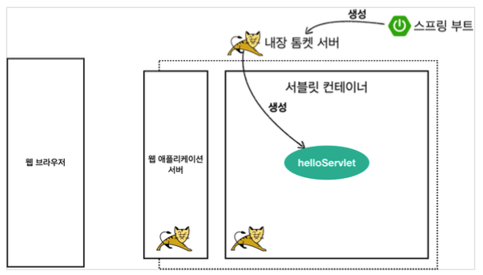

# 스프링 MVC 1편 - 백엔드 웹 개발 핵심 기술

**[ 이 강의를 듣고 난 후 스스로에게 기대하는 점 ]**

- 자바 웹 기술과 스프링 MVC의 개념을 익힌다.
- 스프링 MVC의 핵심 원리와 내부 구조를 이해한다.

## 스프링 웹 MVC

### 웹 애플리케이션 이해

#### [ 웹 서버, 웹 애플리케이션 서버 ]

- **웹 서버 (Web Server)**
  - HTTP 기반으로 동작
  - 정적 리소스 제공, 기타 부가기능
  - 정적(파일) HTML, CSS, JS, 이미지, 영상
  - 예) NGINX, APACHE
- **웹 애플리케이션 서버 (WAS - Web Application Server)**
  - HTTP 기반으로 동작
  - 웹 서버 기능 포함 (정적 리소스 제공 가능)
  - 프로그램 코드를 실행해서 애플리케이션 로직 수행
    - 동적 HTML, HTTP API(JSON)
    - 서블릿, JSP, 스프링 MVC
  - 예) 톰캣(Tomcat), Jetty, Undertow

<br>

**< 차이점 >**
- 웹 서버는 정적 리소스(파일), WAS는 애플리케이션 로직
- 둘의 용어도 경계도 모호함
  - 웹 서버도 프로그램을 실행하는 기능을 포함하기도 함
  - 웹 애플리케이션 서버도 웹 서버의 기능을 제공함
- 자바는 서블릿 컨테이너 기능을 제공하면 WAS
  - 서블릿 없이 자바코드를 실행하는 서버 프레임워크도 존재 함
- 결론: WAS는 애플리케이션 코드를 실행하는데 더 특화되어 있다.

<br>

**< 웹 시스템 구성 - WAS, DB >** <br>
: WAS는 정적 리소스와 애플리케이션 로직 모두 제공 가능하므로 WAS와 DB 만으로 시스템 구성이 가능하다. 
하지만 이렇게 되면 WAS가 너무 많은 역할을 담당하게 되고, 서버 과부하 우려로 이어진다.
가장 비싼 애플리케이션 로직이 정적 리소스 때문에 수행이 어려워질 수 있으며, 웹 서버와 달리 WAS는 장애 시 오류 화면도 노출할 수 없다.

<br>

**< 웹 시스템 구성 - WEB, WAS, DB >** <br>
: 정적 리소스는 웹 서버가 처리하고, 애플리케이션 로직같은 동적인 처리가 필요하면 WAS에 요청을 위임한다. WAS는 중요한 애플리케이션 로직 처리에 집중(전담)할 수 있다.
따라서, 정적 리소스가 많이 사용되면 Web 서버를 증설하고 애플리케이션 리소스가 많이 사용되면 WAS를 증설할 수 있어 효율적인 리소스 관리를 할 수 있다.

또 다른 이점으로는 정적 리소스만 제공하는 웹 서버는 잘 죽지 않고, 애플리케이션 로직이 동작하는 WAS 서버는 잘 죽는데, 이런 경우 WAS, DB 장애 시 WEB 서버가 오류 화면을 제공해줄 수 있다.

<br>

#### [ 서블릿 ]

**< 서버에서 처리해야 하는 업무 >**
1. 서버 TCP/IP 대기, 소켓 연결
2. HTTP 요청 메시지를 파싱해서 읽기
3. HTTP method와 url 확인
4. Content-Type 확인
5. HTTP 메시지 바디 내용 파싱
   - 데이터를 사용할 수 있게 파싱
6. 저장 프로세스 실행
7. 비즈니스 로직 실행
   - 데이터베이스에 작업(저장, 삭제, 조회 등) 요청
8. HTTP 응답 에시지 생성 시작
   - HTTP 시작 라인 생성
   - Header 생성
   - 메시지 바디에 HTML 생성해서 입력
9. TCP/IP 응답 전달, 소켓 종료

이 처럼 서버에서 처리해야 하는 업무는 방대하다. 하지만 서블릿을 지원하는 WAS를 사용하면, 서버는 '7. 비즈니스 로직 실행'만 수행하면 된다. 나머지는 서블릿이 해준다.

<br>

**< 흐름 >**
- HTTP 요청 시
  - WAS는 Request, Response 객체를 새로 만들어서 서블릿 객체 호출
  - Request 객체에서 HTTP 요청 정보를 편리하게 꺼내서 사용
  - Response 객체에 HTTP 응답 정보를 편리하게 입력
  - WAS는 Response 객체에 담겨있는 내용으로 HTTP 응답 정보를 생성

<br>

**< 서블릿 컨테이너 >**
- 톰캣처럼 서블릿을 지원하는 WAS를 서블릿 컨테이너라고 함
- 서블릿 컨테이너는 서블릿 객체를 생성, 초기화, 호출, 종료까지 생명주기를 관리
- 서블릿 객체는 **싱글톤으로 관리**
  - 고객의 요청이 올 때마다 계속 객체를 생성하는 것은 비효율
  - 최초 로딩 시점에 서블릿 객체를 미리 만들어두고 재활용
  - 모든 고객 요청은 동일한 서블릿 객체 인스턴스에 접근
  - **공유 변수 사용 주의**
  - 서블릿 컨테이너 종료시 함께 종료
- JSP도 서블릿으로 변환 되어서 사용
- 동시 요청을 위한 멀티 쓰레드 처리 지원

<br>

#### [ 동시 요청 - 멀티 쓰레드 ]

**< 쓰레드 >**
- 애플리케이션 코드를 하나하나 순차적으로 실행하는 것은 쓰레드
- 자바 메인 메서드를 처음 실행하면 main이라는 이름의 쓰레드가 실행
- 쓰레드가 없다면 자바 애플리케이션 실행이 불가능
- 쓰레드는 한번에 하나의 코드 라인만 수행
- 동시 처리가 필요하면 쓰레드를 추가로 생성

<br>

**< 요청마다 쓰레드를 생성할 경우 >**
- **장점**
  - 동시 요청을 처리할 수 있다.
  - 리소스(CPU, 메모리)가 허용할 때까지 처리 가능
  - 하나의 쓰레드가 지연 되어도, 나머지 쓰레드는 정상 동작한다.
- **단점**
  - 쓰레드는 생성 비용이 매우 비싸다.
    - 고객의 요청이 올 때마다 쓰레드를 생성하면 응답 속도가 늦어진다.
  - 쓰레드는 컨텍스트 스위칭 비용이 발생한다.
  - 쓰레드 생성에 제한이 없다.
    - 고객 요청이 너무 많이 오면 CPU, 메모리 임계점을 넘어서 서버가 죽을 수 있다.

<br>
    
**< 쓰레드 풀 >**
- **특징**
  - 필요한 쓰레드를 쓰레드 풀에 보관하고 관리한다.
  - 풀에 생성 가능한 쓰레드의 최대치를 관리한다. 톰캣은 최대 200개 기본 설정 (변경 가능)
- **사용**
  - 쓰레드가 필요하면, 이미 생성되어 있는 쓰레드를 쓰레드 풀에서 꺼내서 사용
  - 사용을 종료하면 쓰레드 풀에 해당 쓰레드를 반납
  - 최대 쓰레드가 모두 사용중이어서 쓰레드 풀에 쓰레드가 없을 경우에 기다리는 요청은 거절하거나 특정 수 만큼만 대기하도록 설정할 수 있다.
- **장점**
  - 쓰레드가 미리 생성되어 있으므로, 쓰레드를 생성하고 종료하는 비용(CPU)이 절약되고, 응답 시간이 빠르다.
  - 생성 가능한 쓰레드의 최대치가 있으므로 너무 많은 요청이 들어와도 기존 요청은 안전하게 처리할 수 있다.
- **쓰레드 풀의 적정 숫자**
  - 너무 낮게 설정해도, 너무 높게 설정해도 문제가 생긴다.
  - 적정 숫자는 애플리케이션 로직의 복잡도, CPU, 메모리, IO 리소스 상황에 따라 모두 다름
  - 성능 테스트
    - 최대한 실제 서비스와 유사하게 성능 테스트 시도
    - 툴: 아파치 ab, 제이미터, nGrinder

<br>

**< WAS의 멀티 쓰레드 지원 >**
- 멀티 쓰레드에 대한 부분은 WAS가 처리
- **개발자가 멀티 쓰레드 관련 코드를 신경쓰지 않아도 됨**
- 개발자는 **싱글 쓰레드 프로그래밍을 하듯 편리하게 소스 코드를 개발할 수 있다.**
- 멀티 쓰레드 환경이르로 싱글톤 객체(서블릿, 스프링 빈)는 주의해서 사용

<br>

#### [ SSR, CSR ]
- **SSR - 서버 사이드 렌더링**
  - HTML 최종 결과를 서버에서 만들어서 웹 브라우저에 전달
  - 주로 정적인 화면에 사용
  - 관련 기술: JSP, 타임리프 -> **백엔드 개발자**
- **CSR - 클라이언트 사이드 렌더링**
  - HTML 결과를 자바스크립트를 사용해 웹 브라우저에서 동적으로 생성해서 적용
  - 주로 동적인 화면에 사용, 웹 환경을 마치 앱 처럼 필요한 부분만 변경할 수 있음
  - 예) 구글 지도, Gmail, 구글 캘린더
  - 관련 기술: React, Vue.js -> **웹 프론트엔드 개발자**
- **참고**
  - React, Vue.js를 CSR + SSR 동시에 지원하는 웹 프레임워크도 있음
  - SSR을 사용하더라도, 자바스크립트를 사용해서 화면 일부를 동적으로 변경 가능


### 서블릿
참고: 서블릿 섹션의 코드는 servlet 폴더에 위치 ( [바로가기 클릭](servlet) )

<br>

####[ 서블릿 컨테이너 동작 방식 ]



<br>

#### [ HttpServletRequest ]
: HTTP 요청 메시지를 개발자가 직접 파싱해서 사용해도 되지만, 매우 불편할 것이다. 
서블릿은 개발자가 HTTP 요청 메시지를 편리하게 사용할 수 있도록 HTTP 요청 메시지를 파싱한다. 
그리고 그 결과 `HttpServletRequest` 객체에 담아서 제공한다.

HttpServletRequest를 사용하면 다음과 같은 HTTP 요청 메시지를 편리하게 조회할 수 있다.

**HTTP 요청 메시지**
```
POST /save HTTP/1.1
Host: localhost:8080
Content-Type: application/x-www-form-urlencoded

username=kim&age=20
```
- **START LINE**
  - HTTP 메서드
  - URL
  - 쿼리스트링
  - 프로토콜 버전
- **헤더**
  - 헤더 조회
- **바디**
  - form 파라미터 형식 조회
  - message body 데이터 직접 조회

<br>

- **임시 저장소 기능**
  - 해당 HTTP 요청이 시작부터 끝날 때까지 유지되는 임시 저장소 기능
    - 저장: `request.setAttribute(name, value)`
    - 조회: `request.getAttribute(name)`
- **세션 관리 기능**
  - `request.getSession(create: true)`

**< HTTP 요청 데이터 >**

: HTTP 요청 메시지를 통해 클라이언트에서 서버로 데이터를 전달하는 방법을 알아보자.

- **GET - 쿼리 파라미터**
  - /url?username=hello&age=20
  - 메시지 바디 없이, URL의 쿼리 파라미터에 데이터를 포함해서 전달
  - 예) 검색, 필터, 페이징 등에서 많이 사용하는 방식
- **POST - HTML Form**
  - content-type: application/x-www-form-urlencoded
  - 메시지 바디에 쿼리 파라미터 형식으로 전달 -> username=hello&age=20
  - 예) 회원 가입, 상품 주문, HTML Form 사용
- **HTTP message body**에 데이터를 직접 담아서 요청
  - HTTP API에서 주로 사용 (JSON, XML, TEXT)
  - 데이터 형식은 주로 JSON 사용

> HttpServletRequest 사용법은 코드 참고 [( **코드 바로가기** )](servlet/src/main/java/hello/servlet/basic/request) 

<br>

#### [ HttpServletResponse ]

- **HttpServletResponse 역할**
  - **HTTP 응답 메시지 생성**
    - HTTP 응답코드 지정
    - 헤더 생성
    - 바디 생성
  - **편의 기능 제공**
    - Content-Type, 쿠키, Redirect

> HttpServletResponse 사용법은 코드 참고 [( **코드 바로가기** )](servlet/src/main/java/hello/servlet/basic/response) 
